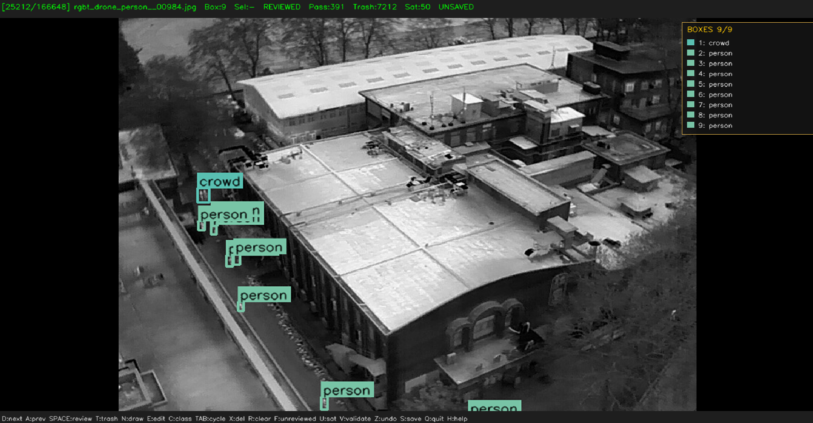
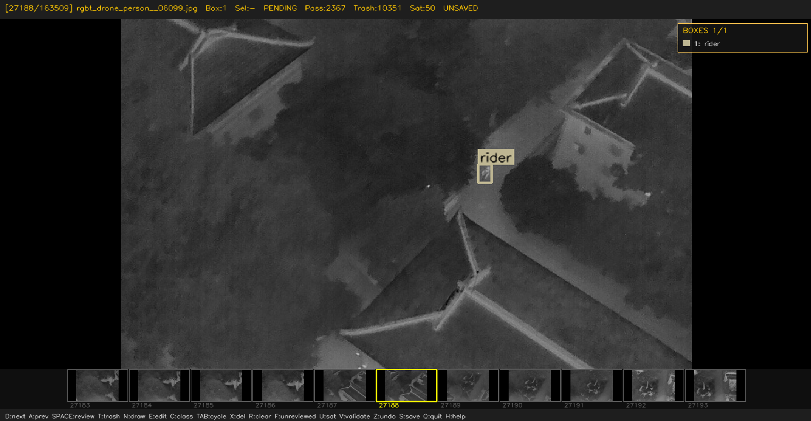

# data-cleaner-cv

A keyboard-driven desktop tool for **reviewing, cleaning, editing, and organizing
object-detection datasets** that combine images with bounding-box labels. It is
designed for human-in-the-loop curation of large datasets (hundreds of thousands
of rows), not for autonomous cleaning.

> **Status:** working tool. CLI args, an interactive first-run wizard, automatic
> schema detection (CSV / YOLO / COCO / Pascal VOC), and a full English UI are
> all in place. See the [Roadmap](#roadmap) for what is still planned.



*Reviewing an infrared drone frame: bounding boxes drawn on the image, the
right-side box list panel, and the live info bar (frame index, counts, status).*



*Thumbnail strip enabled (`[`): 5 previous + current + 5 next frames previewed
along the bottom for fast navigation.*

---

## What it does

- Displays each image with its bounding boxes drawn on top.
- Lets you **trash** an entire frame in one keystroke — the image is moved to
  `_Trash/` and every matching row is removed from the CSV in memory, with
  periodic auto-save so a 1M-row CSV is not rewritten on every keypress.
- Lets you **edit** existing boxes (drag corners/edges, move), **draw** new
  boxes, **delete** individual boxes, and **change the class** of the selected
  box.
- Maintains an `is_satellite` metadata column you can toggle per frame, so you
  can later split satellite/aerial imagery from ground/air-to-air imagery
  without touching the training labels.
- Persists progress in `_review_progress.json` so closing the window resumes
  exactly where you left off.
- Per-frame **box list panel** on the right — click a row to select the
  corresponding box (helpful when boxes are small or overlapping).

---

## Expected data layout

```
your_workspace/
├── images/                 # all image files (.png, .jpg, .jpeg)
├── labels.csv              # one row per bounding box
├── workspace_config.json   # optional — class id ↔ name mapping (auto-built if missing)
├── _Trash/                 # created by the tool; trashed images land here
└── _review_progress.json   # created by the tool; resume state
```

### `labels.csv` columns

The tool currently expects a CSV with at least these columns:

| column          | meaning                                                |
|-----------------|--------------------------------------------------------|
| `new_filename`  | image filename inside `images/` (e.g. `00042.jpg`)     |
| `class_name`    | textual class label (e.g. `car`, `person`)             |
| `cx`, `cy`      | YOLO-normalized box center in `[0, 1]`                 |
| `w`, `h`        | YOLO-normalized box width/height in `[0, 1]`           |
| `img_width`     | optional; falls back to the actual image size on load  |
| `img_height`    | optional; same fallback                                |
| `reviewed`      | boolean; set to `True` when you mark a frame reviewed  |
| `is_satellite`  | 0/1 metadata flag, toggled with `U`                    |

`reviewed` and `is_satellite` are created automatically if missing.

> Generalizing this schema (autodetect Pascal/YOLO/COCO; rename columns at load;
> allow xyxy or cxcywh in pixels) is part of the roadmap.

---

## Install

### 1. Prerequisites

- **Python 3.8 or newer.** Check with:

  ```bash
  python --version
  ```

  If Python is not installed, get it from [python.org](https://www.python.org/downloads/).
  On Windows, make sure to tick **"Add python.exe to PATH"** in the installer.
- **A desktop OpenCV build.** The tool opens a native window via
  `cv2.imshow`, so headless servers (no display) are not supported.

### 2. Clone the repo

```bash
git clone https://github.com/AlpcanCepikk/data-cleaner-cv.git
cd data-cleaner-cv
```

(If you don't have git, you can also download the ZIP from the GitHub page
and extract it.)

### 3. (Recommended) Create a virtual environment

Keeps the tool's dependencies isolated from your system Python:

```bash
# Windows (PowerShell)
python -m venv .venv
.\.venv\Scripts\Activate.ps1

# macOS / Linux
python3 -m venv .venv
source .venv/bin/activate
```

### 4. Install dependencies

```bash
pip install -r requirements.txt
```

This installs `opencv-python`, `numpy`, and `pandas`.

### 5. (Optional) Pre-define your class list

If you already know the class set you want, copy
`workspace_config.example.json` to `workspace_config.json` inside your
workspace folder and edit the `classes` map. Otherwise the tool builds one
automatically from the most-frequent labels in your dataset on first run.

## Run

Point the tool at your images folder and your labels:

```bash
python review.py --images /path/to/images --labels /path/to/labels
```

`--labels` accepts any of:

- a `.csv` file,
- a `.json` COCO file,
- a folder of YOLO `.txt` files,
- a folder of Pascal VOC `.xml` files.

The format is auto-detected and normalized into a working `labels.csv` inside
the workspace (`--workspace DIR`, defaults to the labels' directory). If you
run `python review.py` with no arguments, an interactive wizard asks for the
paths; if `images/` and `labels.csv` happen to sit next to `review.py`, those
are used automatically.

A native window opens with the first frame; press `H` any time for an in-app
help overlay. Press `Q` to save and exit — the next run resumes from the same
frame index.

### Export

```bash
python review.py --images <dir> --labels <workspace>/labels.csv --export-yolo out_dir
python review.py --images <dir> --labels <workspace>/labels.csv --export-coco out.json
```

---

## Getting started

A typical first session looks like this:

1. **Lay out your data** as shown in [Expected data layout](#expected-data-layout):
   put all images in `images/` and your label rows in `labels.csv` (YOLO-normalized
   `cx, cy, w, h`). Drop `review.py` next to them.
2. **Install dependencies** with `pip install -r requirements.txt`.
3. **Run** `python review.py`. On the very first run, the tool:
   - scans `images/` and drops any CSV rows that point to missing images;
   - builds a class id ↔ name map from the top 21 most-frequent `class_name`
     values in your CSV, and writes it to `workspace_config.json` so the
     mapping stays stable across runs. Edit that file by hand if you want
     a different ordering or set of classes.
4. **Review frames one by one.** For each image:
   - press `D` (or `→`) to go to the next frame without changing anything;
   - press `SPACE` to mark the current frame as reviewed and advance;
   - press `T` to trash the whole frame — the image moves to `_Trash/` and
     all rows for that filename are removed from the CSV in memory;
   - click a box on the image (or its row in the right-side panel) to select
     it, then press `E` to drag its corners/edges, `X` to delete it, or
     `C` to change its class;
   - press `N` to draw a brand-new box: drag a rectangle, then pick the class
     by typing the class id;
   - press `U` to flag the frame as a satellite/aerial shot (metadata only;
     does not affect labels).
5. **Save and quit** with `Q` (or press `S` to save mid-session). The CSV is
   also auto-saved every `AUTOSAVE_EVERY` trashes (default `50`).
6. **Resume any time.** Progress is stored in `_review_progress.json`; the
   next run picks up at the same frame index.

### Tips

- Use `F` to jump straight to the next frame that has not been reviewed yet —
  much faster than walking through reviewed frames one at a time.
- Use `Z` immediately after `T` to undo a wrong trash; the image is moved back
  out of `_Trash/` and the rows are restored.
- If many small boxes overlap, the **right-side box list panel** is faster
  than clicking on the image — each row shows the box index and class, and
  clicking it selects that box.
- `is_satellite` is just a column on each row. After a session, you can split
  the dataset by filtering `labels.csv` with pandas:
  `df[df["is_satellite"] == 1]["new_filename"].unique()`.

## Controls

| key                | action                                                  |
|--------------------|---------------------------------------------------------|
| `D` / `→`          | next frame                                              |
| `A` / `←`          | previous frame                                          |
| `SPACE`            | mark current frame reviewed, advance                    |
| `T`                | trash frame (image → `_Trash/`, rows → dropped)         |
| `Z`                | undo last trash                                         |
| `Click`            | select box (on image or right-side list panel)          |
| `Shift+Click`      | add / remove box from a multi-selection                 |
| `TAB`              | cycle box selection                                     |
| `X`                | delete selected box (or the whole multi-selection)      |
| `R`                | remove every box in this frame                          |
| `N`                | draw new box (drag, then pick class)                    |
| `E`                | edit selected box (drag corners / edges / move)         |
| `C`                | change class of selected box                            |
| `K`                | crop a region (drag → `ENTER` apply, `ESC` cancel)      |
| `F`                | jump to next unreviewed frame                           |
| `U`                | toggle `is_satellite` flag for current frame            |
| `V` / `Shift+V`    | validate CSV (report only / drop bad rows)              |
| `P`                | toggle statistics overlay                               |
| `/`                | cycle class filter (box-list panel only)                |
| `[`                | toggle thumbnail strip                                  |
| `S`                | save CSV                                                |
| `Q`                | save and quit                                           |
| `H`                | show in-app help overlay                                |
| `ESC`              | cancel edit / draw / class-pick mode, close overlays    |

When a class is being assigned (after drawing a new box or after pressing `C`):
type the class id with the digits `0–9`; for ids `10–19` press `1` then a
digit; for id `20` press `2` then `0`.

---

## Cropping

Press `K`, drag a region, and press `ENTER` to crop the current image to that
region. The cropped image overwrites the original on disk (the original is
backed up under `workspace/_originals/` so `Z` can undo the crop). All boxes
are re-normalized to the new image size; a box that straddles the crop edge is
clipped, and dropped entirely if less than 30% of its original area remains
inside the crop. `ESC` cancels.

---

## Auto-save & backups

The tool auto-saves every **50** trashes by default (`--autosave N` to change).
This avoids rewriting a million-row CSV on every keystroke while staying durable
against crashes. You can also force a save with `S` or `Q`. Every save writes a
timestamped backup into `workspace/_backups/`, keeping the most recent 3.

---

## Roadmap

Done:

- [x] **English-only UI.**
- [x] **CLI args**: `python review.py --images <dir> --labels <path>`.
- [x] **First-run setup wizard** with automatic schema detection
      (CSV, YOLO `.txt` folder, COCO JSON, Pascal VOC XML).
- [x] **Export** to YOLO `.txt` and COCO JSON (`--export-yolo`, `--export-coco`).
- [x] **Thumbnail strip** showing nearby frames (`[`).
- [x] **Statistics overlay** (`P`), **CSV validator** (`V`), **rotating backups**.

Still planned:

- [ ] **Universal class discovery**: on `N` (draw new box) and `C` (change
      class), pull classes from the live CSV *plus* user-defined ones.
- [ ] Export back to Pascal VOC.
- [ ] Bounding-box snapping and keyboard nudging in edit mode.
- [ ] Tk/PyQt rewrite for a proper menu bar and file pickers.

If you have a wishlist item, open an issue.

---

## License

TBD — to be added before the first tagged release.
